System design and implementation guide for the BNO055 IMU hardware interface.

## Overview

The BNO055 Hardware Interface is a `ros2_control` `SensorInterface` plugin that connects ROS 2 to the Bosch BNO055 9-DOF IMU via Linux I2C (`i2c-dev`). It uses the official [Bosch BNO055 driver](https://github.com/BoschSensortec/BNO055_driver) C library (included as a git submodule) and runs the sensor in a configurable **sensor fusion mode** — `NDOF` (9-DOF absolute, default), `NDOF_FMC_OFF` (9-DOF for magnetically noisy environments), or `IMUPLUS` (6-DOF without magnetometer) — providing drift-free orientation along with calibrated gyroscope and accelerometer readings.

**Key design goals:**

- Zero quaternion-integration drift — orientation is computed on-chip by Bosch's proprietary fusion algorithm
- Calibration persistence — offsets can be saved and loaded, so the sensor starts calibrated immediately after boot
- Flexibility — axis remapping and I2C address are runtime parameters; mock mode allows full lifecycle testing without hardware

---

## System Architecture

**Architecture Layers:**

1. **ROS 2 Controllers** — Reads state interfaces via `ros2_control` (e.g `imu_sensor_broadcaster`)
2. **Hardware Interface** — `SensorInterface` plugin bridging `ros2_control` to the BNO055 over I2C
3. **Bosch SensorAPI** — C library (`external/BNO055_driver/`) providing register-level access via wired callbacks
4. **I2C Layer** — Linux `i2c-dev` / SMBus via `src/bno055_i2c.c`; opens `/dev/i2c-{bus}`
5. **BNO055 Sensor** — On-chip fusion (NDOF / NDOF_FMC_OFF / IMUPLUS): gyroscope + accelerometer + magnetometer (mag unused in IMUPLUS)
6. **Companion Nodes** — `imu_tf_broadcaster` (TF relay, optional) and `bno055_diagnostics` (sensor health on `/diagnostics` at 1 Hz via independent I2C fd, optional)



---

## Sensor Fusion Modes

The sensor fusion mode is set via the `sensor_mode` hardware parameter (default: `NDOF`). The plugin validates the value in `on_init` against a fixed lookup table (`kOperationMode`) and returns `ERROR` for any unknown mode. The selected mode is applied in step 9 of the `on_configure` sequence.

Three modes are supported:

| Mode | BNO055 Constant | Sensors Used | Heading Reference | Use Case |
|------|----------------|--------------|------------------|----------|
| `NDOF` | `BNO055_OPERATION_MODE_NDOF` | Gyro + Accel + Mag | Absolute (compass-referenced) | Default — drift-free absolute orientation |
| `NDOF_FMC_OFF` | `BNO055_OPERATION_MODE_NDOF_FMC_OFF` | Gyro + Accel + Mag | Absolute (compass-referenced) | Same as NDOF but fast magnetometer calibration disabled — better near motors or speakers |
| `IMUPLUS` | `BNO055_OPERATION_MODE_IMUPLUS` | Gyro + Accel only | Relative (no compass) | Magnetically noisy environments; heading drifts slowly over time |

**Magnetometer calibration note:** `NDOF` requires figure-8 magnetometer calibration for best accuracy. `NDOF_FMC_OFF` also uses the magnetometer but skips fast calibration — regular figure-8 motion still improves accuracy over time. `IMUPLUS` does not use the magnetometer at all — no magnetometer calibration is needed.

All three modes use the Bosch SIC (Sensor Intelligence Center) on-chip ARM Cortex-M0 for fusion. Because fusion runs on-chip, the host reads already-fused values — no Madgwick/Mahony filter required on the CPU.

Detailed sensor contributions in `NDOF` mode:

| Sensor | Output contribution |
|--------|-------------------|
| Gyroscope (±2000°/s) | Short-term angular rate and rotation |
| Accelerometer (±4g) | Gravity vector for tilt estimation |
| Magnetometer | Absolute heading correction (compass reference) |

---

## on_configure Sequence

The full hardware initialisation sequence executed in `on_configure()`:

0. **Reset error counter** — `consecutive_read_errors_` is reset to 0, ensuring a clean retry budget on every configure attempt (including after `on_cleanup` / reconfigure cycles)
1. **Open I2C bus** — `bno055_i2c_open("/dev/i2c-{bus}", addr)` via `i2c-dev` ioctl
2. **Wire Bosch driver callbacks** — set `sensor_.bus_read`, `sensor_.bus_write`, `sensor_.delay_msec`, `sensor_.dev_addr`
3. **`bno055_init()`** — reads chip ID register (expected `0xA0`), populates `sw_rev_id`; RCLCPP_INFO logs chip ID and software revision
4. **Set CONFIG mode** — `bno055_set_operation_mode(BNO055_OPERATION_MODE_CONFIG)` + 25 ms delay (datasheet requirement: ≥19 ms)
5. **Set NORMAL power mode** — `bno055_set_power_mode(BNO055_POWER_MODE_NORMAL)`
6. **Set measurement units** — `bno055_set_gyro_unit(BNO055_GYRO_UNIT_RPS)` and `bno055_set_accel_unit(BNO055_ACCEL_UNIT_MSQ)`
7. **Load calibration offsets** — if `calib_file_` is non-empty, open the YAML, parse key/value pairs, write accel/gyro/mag offsets and radii via `bno055_write_accel_offset / _gyro_offset / _mag_offset` (must be done in CONFIG mode, before entering the configured fusion mode)
8. **Apply axis remap** — write `AXIS_MAP_CONFIG` and `AXIS_MAP_SIGN` register bytes directly via wired `bus_write` callback (values from `kAxisRemap` lookup table)
9. **Activate fusion mode** — `bno055_set_operation_mode(kOperationMode.at(sensor_mode_))` + 20 ms delay (datasheet requirement: ≥7 ms for NDOF; same delay used for all three supported modes)

In **mock mode** (`enable_mock_ = true`), the entire sequence is skipped and `on_configure` returns `SUCCESS` immediately.

### on_cleanup

When the lifecycle node is cleaned up: `bno055_set_power_mode(BNO055_POWER_MODE_SUSPEND)` puts the sensor into low-power state, then `bno055_i2c_close()` closes the file descriptor. All state interface doubles are then reset to their initial values (identity quaternion `w=1`, zeros elsewhere) so that any subsequent re-configure starts from a clean slate.

### on_shutdown

Identical to `on_cleanup` — suspends the sensor, closes the I2C file descriptor, and resets all state doubles. Ensures clean teardown regardless of which lifecycle transition triggers the exit.

### read()

Called at the controller update rate (100 Hz per `imu_broadcaster.yaml`):

- **Mock mode**: state vector stays at initial values (0.0 for velocity/acceleration, identity quaternion w=1.0)
- **Real hardware**: calls `bno055_read_quaternion_wxyz()` (raw int16 quaternion, scaled by `1/16384`), `bno055_convert_double_gyro_xyz_rps()` (returns rad/s directly), and `bno055_convert_double_linear_accel_xyz_msq()` (returns m/s² directly); writes results to state interface doubles

---

## State Interfaces

| Interface | Unit | Raw Scale | Description |
|-----------|------|-----------|-------------|
| `orientation.x` | – | raw ÷ 16384 | Quaternion X component (2¹⁴ LSB/unit, datasheet §3.6.5.5) |
| `orientation.y` | – | raw ÷ 16384 | Quaternion Y component |
| `orientation.z` | – | raw ÷ 16384 | Quaternion Z component |
| `orientation.w` | – | raw ÷ 16384 | Quaternion W component (scalar) |
| `angular_velocity.x` | rad/s | raw ÷ 900 | Gyroscope X — unit set to RPS (radians per second) |
| `angular_velocity.y` | rad/s | raw ÷ 900 | Gyroscope Y |
| `angular_velocity.z` | rad/s | raw ÷ 900 | Gyroscope Z |
| `linear_acceleration.x` | m/s² | raw ÷ 100 | Accelerometer X — unit set to m/s² (MSQ) |
| `linear_acceleration.y` | m/s² | raw ÷ 100 | Accelerometer Y |
| `linear_acceleration.z` | m/s² | raw ÷ 100 | Accelerometer Z |

**Note:** The `imu_sensor_broadcaster` (configured in `config/imu_broadcaster.yaml`) reads these interfaces and publishes a `sensor_msgs/Imu` message on `/imu_sensor_broadcaster/imu` at 100 Hz with `frame_id: imu_frame`.

---

## Axis Remapping

The BNO055 supports 8 standard mounting orientations. The correct P-code for a given PCB orientation is read from BNO055 datasheet §3.4 and set via the `axis_remap` parameter at launch time. Register values are written directly in CONFIG mode before switching to the configured fusion mode:

| P-Code | AXIS_MAP_CONFIG (0x41) | AXIS_MAP_SIGN (0x42) |
|--------|----------------------|---------------------|
| **P0** | `0x21` | `0x04` |
| **P1** (default) | `0x24` | `0x00` |
| **P2** | `0x24` | `0x06` |
| **P3** | `0x21` | `0x02` |
| **P4** | `0x24` | `0x03` |
| **P5** | `0x21` | `0x01` |
| **P6** | `0x21` | `0x07` |
| **P7** | `0x24` | `0x05` |

Values match the `flynneva/bno055` P-code table and Bosch datasheet Table 3-4. The lookup table is defined as a `static const std::map<std::string, std::pair<uint8_t, uint8_t>>` in the plugin source (`kAxisRemap`).

---

## Hardware Parameters

| Parameter | Type | Default | Description |
|-----------|------|---------|-------------|
| `i2c_bus` | `int` | `1` | I2C bus number; the plugin opens `/dev/i2c-{n}` |
| `i2c_addr` | `string` | `"28"` | I2C address as hex without `0x` prefix. `28` = 0x28 (ADR pin low, default); `29` = 0x29 (ADR pin high) |
| `axis_remap` | `string` | `"P1"` | Mounting orientation P0–P7 for axis remapping (see table above). Invalid values cause `on_init` to return `ERROR` |
| `sensor_mode` | `string` | `"NDOF"` | Fusion mode: `NDOF` (9-DOF absolute), `NDOF_FMC_OFF` (9-DOF, no fast mag calibration), `IMUPLUS` (6-DOF, no magnetometer). Invalid values cause `on_init` to return `ERROR` |
| `enable_mock` | `bool` | `false` | When `true`, skip all I2C operations and publish zero angular velocity, zero linear acceleration, and identity quaternion (w=1) |
| `calib_file` | `string` | `""` | Absolute path to calibration YAML. Empty string = start uncalibrated |

---

## Calibration System

### Overview

The BNO055 performs self-calibration dynamically. Each sub-sensor reports a calibration level 0–3 (3 = fully calibrated). In all fusion modes, calibration is automatic but non-persistent — offsets are lost at power off.

To persist calibration across reboots:

1. Read the sensor’s calibration offsets (via Bosch SensorAPI) and store them in a YAML file
2. Pass the file path as the `calib_file` hardware parameter — the plugin reads the YAML and writes offsets into the sensor in CONFIG mode before entering the configured fusion mode, so it starts pre-calibrated

### Calibration YAML Format

The YAML expected by the hardware interface plugin:

```yaml
accel_offset_x: 14
accel_offset_y: -8
accel_offset_z: -21
accel_radius: 1000
gyro_offset_x: 0
gyro_offset_y: 1
gyro_offset_z: -1
mag_offset_x: 285
mag_offset_y: -134
mag_offset_z: 478
mag_radius: 857
```

All values are raw 16-bit integers as defined by the Bosch SensorAPI offset structs (`bno055_accel_offset_t`, `bno055_gyro_offset_t`, `bno055_mag_offset_t`).

### Calibration Tips

| Sub-sensor | How to calibrate |
|-----------|------------------|
| **Gyroscope** | Place on a stable surface and keep completely still for ~10 s |
| **Accelerometer** | Hold still in at least 6 different orientations (each face pointing down), ~3 s each |
| **Magnetometer** | Move slowly in a figure-8 pattern in the air, away from metal objects |
| **System** | Reaches 3 only when gyro + accel + mag are all at level 3 (NDOF/NDOF_FMC_OFF); gyro + accel in IMUPLUS |

### Offset Loading in the Plugin

`load_calib_offsets()` is called in `on_configure()` while the sensor is in CONFIG mode (step 7 of the initialisation sequence). It:

1. Opens `calib_file_` as an `std::ifstream`; returns `false` on failure (logged as a warning, not an error — the plugin continues uncalibrated)
2. Parses each `key: value` line into an `unordered_map<string, int16_t>`
3. Fills `bno055_accel_offset_t`, `bno055_gyro_offset_t`, `bno055_mag_offset_t` structs
4. Writes all three via `bno055_write_accel_offset()`, `bno055_write_gyro_offset()`, `bno055_write_mag_offset()`
5. Logs each offset set applied at `RCLCPP_INFO` level

If the file is missing or unreadable, the node logs a warning and continues running — the sensor will recalibrate dynamically in NDOF mode.

---

## I2C Communication

The plugin uses the Linux `i2c-dev` kernel interface via `src/bno055_i2c.c`. The Bosch SensorAPI is wired to this layer through three callbacks:

| Callback | Implementation | Description |
|----------|---------------|-------------|
| `sensor_.bus_read` | `BNO055_I2C_bus_read()` | SMBus read: `i2c_smbus_read_byte_data` (1 byte) or `i2c_smbus_read_i2c_block_data` (multi-byte) |
| `sensor_.bus_write` | `BNO055_I2C_bus_write()` | SMBus write: `i2c_smbus_write_byte_data` (1 byte) or `i2c_smbus_write_i2c_block_data` (multi-byte) |
| `sensor_.delay_msec` | `BNO055_delay_msek()` | `usleep(ms * 1000)` |

**I2C addresses:**

| ADR pin | Address | `i2c_addr` param |
|---------|---------|-----------------|
| Low (GND) | 0x28 | `"28"` (default) |
| High (VDD) | 0x29 | `"29"` |

**Bus access:** a single file descriptor is kept open for the lifetime of the hardware interface (from `on_configure` to `on_cleanup`). No locking is done in user space — the Linux `i2c-dev` kernel driver serialises concurrent SMBus calls at the adapter level, so the diagnostics node can safely share the bus (see Diagnostics Node section).

**Self-test:** On init, the Bosch driver reads the chip ID register (expected `0xA0`). Note: the plugin does not read the full self-test register (`SELFTEST_RESULT`, which returns `0x0F` when all four sub-systems pass) — only the chip ID is verified.

---

## Mock Mode

When `enable_mock: true`, the plugin skips all I2C operations:

- `on_configure`: returns `SUCCESS` immediately (no device opened)
- `on_read`: state interfaces hold their initial values:
  - `orientation.{x,y,z}` = 0.0, `orientation.w` = 1.0 (identity quaternion)
  - `angular_velocity.{x,y,z}` = 0.0
  - `linear_acceleration.{x,y,z}` = 0.0
- `on_cleanup`: no suspend/close calls

Mock mode is useful for integration testing, CI, and development on machines without a BNO055 attached. All 13 GTest unit tests and 10 launch tests pass in mock mode.

---

## TF Broadcasting

An optional TF relay node (`src/imu_tf_broadcaster.cpp`) subscribes to the IMU topic and republishes the orientation quaternion as a dynamic TF transform for 3D visualisation (e.g. RViz). It is not needed for normal sensor operation — the IMU data is fully available on `/imu_sensor_broadcaster/imu` regardless. Enabled by default for convenience; disable with `publish_tf:=false`.

**Node parameters:**

| Parameter | Default | Description |
|-----------|---------|-------------|
| `imu_topic` | `/imu_sensor_broadcaster/imu` | Source `sensor_msgs/Imu` topic |
| `parent_frame` | `world` | TF parent frame ID |
| `child_frame` | `base_link` | TF child frame ID |
| `translation_x` | `0.0` | X translation in the published transform (metres) |
| `translation_y` | `0.0` | Y translation in the published transform (metres) |
| `translation_z` | `0.0` | Z translation in the published transform (metres) |

The translation parameters allow expressing any fixed offset between `parent_frame` origin and the body represented by `child_frame`. Default is all-zero (coincident origins).

---

## URDF Structure

The reference URDF (`config/bno055.urdf.xacro`) defines three fixed links:

| Link | Parent | Joint | Description |
|------|--------|-------|-------------|
| `base_link` | – | – | Root link |
| `imu_link` | `base_link` | `imu_joint` (fixed) | Physical sensor mounting point |
| `imu_frame` | `imu_link` | `imu_frame_joint` (fixed) | Coordinate frame referenced by `imu_sensor_broadcaster` (`frame_id: imu_frame`) |

The `<ros2_control>` block declares the hardware plugin and all 10 state interfaces as described in the README. The URDF is loaded via `robot_state_publisher` in `bno055.launch.py`.

---

## IMU Broadcaster Configuration

`config/imu_broadcaster.yaml` configures the `controller_manager` and `imu_sensor_broadcaster`:

```yaml
controller_manager:
  ros__parameters:
    update_rate: 100  # Hz
    imu_sensor_broadcaster:
      type: imu_sensor_broadcaster/IMUSensorBroadcaster

imu_sensor_broadcaster:
  ros__parameters:
    sensor_name: bno055
    frame_id: imu_frame

    # Static covariance matrices (row-major 3x3, diagonal)
    static_covariance_orientation:         [0.001,  0.0, 0.0,  0.0, 0.001,  0.0,  0.0, 0.0, 0.001]
    static_covariance_angular_velocity:    [1.0e-5, 0.0, 0.0,  0.0, 1.0e-5, 0.0,  0.0, 0.0, 1.0e-5]
    static_covariance_linear_acceleration: [2.0e-4, 0.0, 0.0,  0.0, 2.0e-4, 0.0,  0.0, 0.0, 2.0e-4]

    # rotation_offset:  # optional software rotation on top of axis_remap
    #   roll:  0.0
    #   pitch: 0.0
    #   yaw:   0.0
```

The covariance values are derived from BNO055 datasheet noise specs:
- **Orientation**: ±2° absolute accuracy → (0.035 rad)² ≈ 0.001 rad²
- **Angular velocity**: ~0.014 °/s/√Hz gyro noise density → ≈1×10⁻⁵ rad²/s²
- **Linear acceleration**: ~150 µg/√Hz accel noise density → ≈2×10⁻⁴ m²/s⁴

The broadcaster reads all 10 state interfaces from the sensor named `bno055` and publishes a `sensor_msgs/Imu` message on `/imu_sensor_broadcaster/imu` at 100 Hz.

---

## Diagnostics Node

An optional companion node (`src/bno055_diagnostics.cpp`) publishes BNO055 sensor health to `/diagnostics` at 1 Hz as a `diagnostic_msgs/DiagnosticArray`. It is purely a monitoring aid — sensor data and (optional) TF are unaffected if it is not running. Enabled by default for convenience; disable with `publish_diagnostics:=false`.

The node opens its own I2C file descriptor independently of the hardware interface plugin. The Linux `i2c-dev` kernel driver serialises concurrent SMBus calls at the adapter level, so both can safely share the bus. The 1 Hz poll causes at most ~200 µs of bus contention per 10 ms control cycle — negligible.

**Node parameters:**

| Parameter | Default | Description |
|-----------|---------|-------------|
| `i2c_bus` | `1` | I2C bus number |
| `i2c_addr` | `"28"` | Hex address without `0x` prefix |
| `sensor_mode` | `"NDOF"` | Fusion mode — suppresses `Calibration (MAG)` entry when `IMUPLUS` |
| `enable_mock` | `false` | Skip I2C; publish a fixed WARN-level status for testing |

**DiagnosticStatus keys (published on `/diagnostics`):**

| Key | Example | Notes |
|-----|---------|-------|
| `System Status` | `Sensor Fusion Running` | Decoded sys_status register string |
| `Calibration (SYS)` | `2/3` | System calibration level 0–3 |
| `Calibration (GYR)` | `3/3` | Gyroscope calibration level 0–3 |
| `Calibration (ACC)` | `3/3` | Accelerometer calibration level 0–3 |
| `Calibration (MAG)` | `1/3` | Magnetometer calibration level 0–3 (omitted in `IMUPLUS` mode) |
| `Temperature` | `42.0 °C` | Gyroscope die temperature — useful context when calibration unexpectedly degrades |

**Status levels:**

| Level | Condition |
|-------|-----------|
| `OK` | All used calibration levels ≥ 1 (sys_status is used as the status message, not as a condition) |
| `WARN` | Any used calibration level < 1 — sensor is still calibrating |
| `ERROR` | sys_status = 1 (System Error) or any I2C read failure |

The `hardware_id` field is set to `/dev/i2c-{n} @ 0x{XX}` for identification in `rqt_robot_monitor`. The node is compatible with `rqt_robot_monitor` and `diagnostic_aggregator` without additional configuration.

---

## Testing

The package ships with a comprehensive test suite covering parameter validation, mock-mode hardware interface behavior, and end-to-end integration with `controller_manager`. All tests run without physical hardware — either as pure C++ unit tests with ROS 2 lifecycle support, or as launch tests that use mock mode.

### Test Architecture

```
test/
├── test_hardware_interface.cpp   # C++ unit tests — mock mode, no I2C
└── test_bno055.launch.py         # Integration: full bringup with enable_mock:=true
```

**Separation of concerns:**

- **C++ unit tests** (`ament_add_gtest`) are compiled and run as standalone executables. They exercise parameter parsing, state interface export, lifecycle transitions, and mock read behaviour without starting the full `controller_manager`.
- **Launch tests** (`add_launch_test`) spin up the real `controller_manager` node in mock mode and validate the live system against expected ROS 2 topic and service behaviour.

---

### Unit Tests: `test_hardware_interface.cpp`

**13 tests** covering parameter validation, state interface export, lifecycle transitions, and mock-mode read behaviour.

**Parameter validation (`on_init`):**

| Test | What Is Covered |
|---|---|
| `InitTest.ValidParams` | Default bus/addr, bus 0/addr 0x29, `enable_mock` flag, `calib_file` path accepted |
| `InitTest.ValidAllSensorModes` | All 3 supported modes (`NDOF`, `NDOF_FMC_OFF`, `IMUPLUS`) accepted without error |
| `InitTest.ValidAllAxisRemaps` | All 8 P-codes (P0–P7) accepted without error |
| `InitTest.InvalidParamsFail` | No sensor → `ERROR`; two sensors → `ERROR`; invalid P-code (P9) → `ERROR`; empty remap → `ERROR`; invalid `sensor_mode` (ACCGYRO) → `ERROR`; non-numeric `i2c_bus` → `ERROR`; non-hex `i2c_addr` → `ERROR` |

**State interface export:**

| Test | What Is Covered |
|---|---|
| `ExportStateInterfacesTest.InterfacesCorrect` | Exactly 10 interfaces exported; all names and prefix (`bno055`) correct; initial values: identity quaternion (w=1), all others 0.0 |

**Lifecycle transitions (mock mode):**

| Test | What Is Covered |
|---|---|
| `MockHwTest.FullLifecycle` | `on_configure → on_activate → on_deactivate → on_cleanup` all return `SUCCESS` |
| `MockHwTest.ReconfigureAfterCleanup` | Configure → cleanup → re-init → re-configure succeeds (fresh instance) |
| `MockHwTest.SameObjectReconfigureCycle` | Same plugin instance can be configured, cleaned up, and re-configured without reinstantiation (ros2_control lifecycle reuse) |
| `MockHwTest.ShutdownFromInactive` | `on_shutdown` from inactive state returns `SUCCESS` |
| `MockHwTest.ShutdownFromActive` | `on_shutdown` from active state returns `SUCCESS` |

**Read behaviour (mock mode):**

| Test | What Is Covered |
|---|---|
| `MockHwTest.ReadOutputsValid` | After `read()`: identity quaternion (w=1, x/y/z=0), all values finite and non-NaN, quaternion norm ≈ 1.0 |
| `MockHwTest.MultipleReadsRemainStable` | 20 consecutive `read()` calls all return `OK` |
| `MockHwTest.StateResetAfterCleanup` | After `on_cleanup`, all state doubles reset to initial values (identity quaternion, zeros elsewhere) |

**Key design:** All tests use mock mode. No I2C bus or physical sensor is required. Tests compile and run with `ament_add_gtest`.

---

### Integration Tests: `test_bno055.launch.py`

Spins up the `bno055.launch.py` configuration with `enable_mock:=true` and validates the full live system:

| Test | What Is Checked |
|---|---|
| `test_controller_manager_service_available` | `/controller_manager/list_controllers` service is reachable |
| `test_imu_broadcaster_is_active` | `imu_sensor_broadcaster` reaches `active` state (polled up to 30 s) |
| `test_imu_topic_published` | `/imu_sensor_broadcaster/imu` topic publishes `sensor_msgs/Imu` messages |
| `test_imu_frame_id` | Published IMU message has `frame_id` = `imu_frame` |
| `test_quaternion_norm_is_unity` | Quaternion norm ≈ 1.0 (within tolerance) |
| `test_angular_velocity_is_finite` | All angular velocity components are finite and non-NaN |
| `test_linear_acceleration_is_finite` | All linear acceleration components are finite and non-NaN |
| `test_imu_publishes_continuously` | Multiple messages received over time (not a one-shot publish) |
| `test_diagnostics_topic_published` | `/diagnostics` publishes at least one `DiagnosticArray` message within 15 s |
| `test_diagnostics_status_level_valid` | BNO055 `DiagnosticStatus` level is `OK`, `WARN`, or `ERROR` |

**Notable implementation details:**

- `test_imu_broadcaster_is_active` uses a **polling loop** (100 ms intervals, 30 s deadline) rather than a fixed sleep, making it robust to system load variation.
- IMU data-validation tests subscribe to the live topic and check the first received message, ensuring the full pipeline (hardware interface → IMU broadcaster → topic) is working end-to-end.
- `test_diagnostics_status_level_valid` collects `/diagnostics` messages for up to 15 s and searches all of them for a `BNO055` status entry — necessary because `controller_manager` also publishes on this topic and the diagnostics node only fires at 1 Hz.

---

### Running the Tests

```bash
# Build with test targets
colcon build --packages-select bno055_hardware_interface

# Run all tests
colcon test --packages-select bno055_hardware_interface

# View results (verbose output shows individual test pass/fail)
colcon test-result --verbose

# Run only the C++ unit tests (faster, no ROS nodes)
colcon test --packages-select bno055_hardware_interface \
  --ctest-args -R "test_hardware_interface"

# Run only the launch integration tests
colcon test --packages-select bno055_hardware_interface \
  --ctest-args -R "test_bno055"
```

**Prerequisites:**
- No hardware required — all tests use mock mode
- `colcon build` must complete successfully before running tests
- C++ linters are disabled to avoid recursing into the Bosch vendor tree (`external/BNO055_driver/`)

---

## Additional Resources

- [bno055_hardware_interface README](https://github.com/adityakamath/bno055_hardware_interface/blob/main/README.md)
- [Quick Start guide](quick-start.md)
- [ros2_control documentation](https://control.ros.org/)
- [Bosch BNO055 driver](https://github.com/BoschSensortec/BNO055_driver)
- [Bosch BNO055 datasheet](https://www.bosch-sensortec.com/products/smart-sensor-systems/bno055/)

